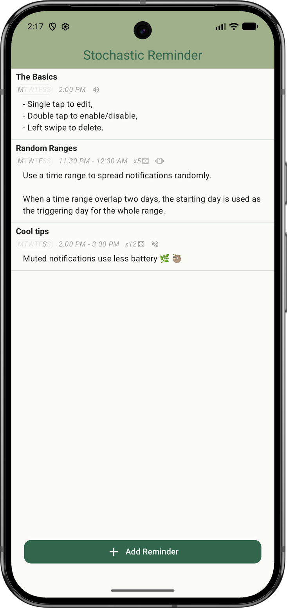
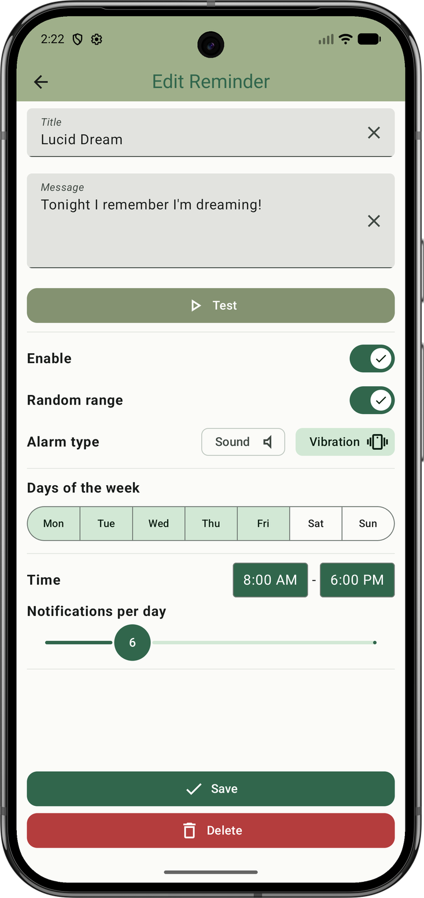

<!--  -->

# Stochastic Reminder (StochaPop!)

_Stochastic Reminder_ is an Android application to schedule weekly fixed and random notifications.

### Features

- Fixed and random scheduling with possible overlapped days,
- Triggered on specific days of the week,
- Specify both the title and long-form multiline message,
- Availables with custom sound, vibration, both or none,
- Exact alarm for non silent notifications,
- Battery preserving scheduling on silent notifications,
- Supported languages: Français 🇫🇷, Italiano 🇮🇹, Español 🇪🇸 und Deutsch 🇩🇪.

## Preview

  <!--  -->
  <!--  -->
  
  

## Acknowledgement

- The [main icon](fastlane/metadata/android/en-US/images/icon.png) come from the [OpenMoji project](https://openmoji.org/) under the _Creative Commons Share Alike License 4.0_
([CC BY-SA 4.0](https://creativecommons.org/licenses/by-sa/4.0/#)).
- The [banner](fastlane/metadata/android/en-US/images/featureGraphic.png) use [Yann le Coroller](https://www.yannlecoroller.com/)'s _Alte Haas Grotesk_ freeware font.

## License

_Stochastic Reminder_ is a _Libre Software_ released under the **GNU General Public License v3.0 only**.

<!--  -->
